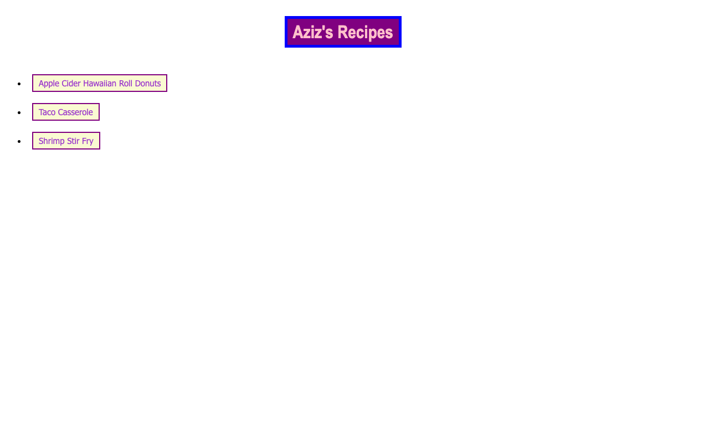

# Odin Recipes

A static recipes website ("Aziz's Recipes") built early in The Odin Project to practice
**semantic HTML, links, and relative file paths**. The home page links to individual
recipe pages.



## Features

- A home page listing recipes (Apple Cider Hawaiian Roll Donuts, Taco Casserole,
  Shrimp Stir Fry).
- Individual recipe pages linked via relative paths.
- Pure HTML/CSS — no build step.

## Tech stack

HTML · CSS

## Getting started

Open `index.html` directly in a browser, or serve the folder:

```bash
npx serve .
```

## What I practiced

The fundamentals: structuring content with **semantic HTML elements**, linking pages
with **relative file paths**, and basic CSS styling. This was one of my first web
projects.

## License

Odin Project coursework — original implementation by Aziz Umarov.
